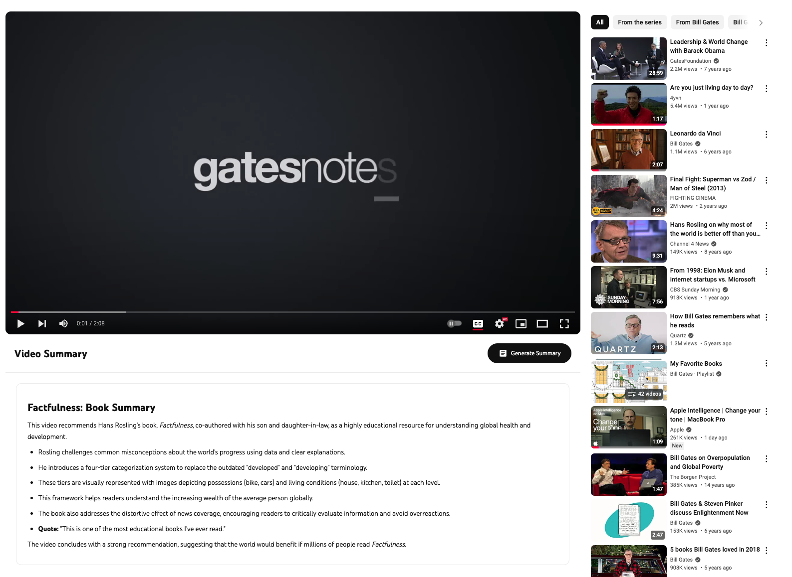

# Youtube Summary Generative AI Extension

A Chrome extension that uses Google Gemini AI to generate video summaries.

## Prerequisites
- Node.js and npm installed
- Google account for API access
- Chrome browser

## Installation Guide

### 1. Set Up the Project
```bash
# Clone the repository
git clone [repository-url]
cd youtube-summary-extension

# Install dependencies
npm install
```

### 2. Configure Google Gemini API
1. Get your API key:
   - Go to [Google AI Studio](https://makersuite.google.com/app/apikey)
   - Sign in with your Google account
   - Click "Create API Key"
   - Copy the generated key

2. Set up environment variables:
   - Create a `.env` file in the project root
   - Add your API key:
     ```env
     GOOGLE_API_KEY=your_api_key_here
     ```
   - Add `.env` to your `.gitignore` file

### 3. Build and Install Extension
1. Build the extension:
   ```bash
   npm run dev
   ```

2. Load in Chrome:
   - Open Chrome and go to `chrome://extensions/`
   - Enable "Developer mode" (top-right corner)
   - Click "Load unpacked"
   - Select the built extension folder

## Usage


## Security Notes
- Never share or commit your API key
- Keep your `.env` file private
- Regularly rotate your API key for security

